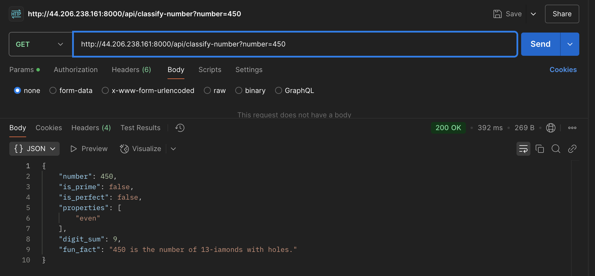
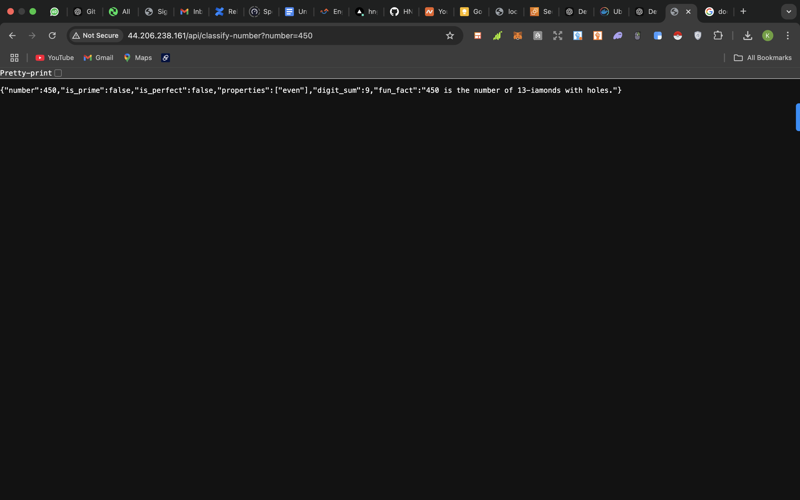

# Number Classification API

## Table of Contents

- [Features](#features)
- [Technology Stack](#technology-stack)
- [Project Structure](#project-structure)
- [Installation](#installation)
- [Local Development](#local-development)
- [API Endpoints](#api-endpoints)
- [Usage Examples](#usage-examples)
- [License](#license)

## Features

- **Number Classification:**  
  - Determines if the number is an Armstrong number.
  - Checks if the number is prime.
  - Checks if the number is a perfect number.
  - Calculates the digit sum.
  - Classifies the number as odd or even.
- **Fun Fact Integration:**  
  - Retrieves a fun math fact from the Numbers API.
- **CORS Enabled:**  
  - Allows cross-origin requests.
- **Static File Handling:**  
  - Serves a favicon from the static directory.
- **Deployment Ready:**  
  - Configured to run as a serverless function on Vercel using the `vercel-asgi` adapter.

## Technology Stack

- **Python 3.8+**
- **FastAPI:** For building the API.
- **Uvicorn:** ASGI server for running the FastAPI app.
- **Requests:** For HTTP requests to the Numbers API.
- **Docker:** Containerization && Deployment


## Project Structure


- **main.py:** Contains all the API logic, endpoints, and helper functions..
- **static/favicon.ico:** A favicon file to serve for the endpoint `/favicon.ico`.
- **requirements.txt:** Lists required packages and their versions.
- **Dockerfile:** Text file containing instructions for building and shipping the source code.

## Installation

1. **Clone the repository:**

   ```bash
   git clone https://github.com/Healerkay/HNG-Devops-Task  
    ```

2. **Create and activate a virtual environment::**
    ```
    python -m venv venv
    ```
    ```
    On macOS/Linux:
    source venv/bin/activate
    ```
    ```
    On Windows:
    venv\Scripts\activate

    ```

3. **Install dependencies:::**

    ```
    pip install -r requirements.txt      

    ```  

# Local Development
Ensure you have the static directory and a favicon.ico file in it.

Run the application using Uvicorn:
```
uvicorn main:app --reload
```

# Access the API: 

Root endpoint: http://127.0.0.1:8000/  

API endpoint: http://127.0.0.1:8000/api/classify-number?number=371  

Swagger UI documentation: http://127.0.0.1:8000/docs


# Remote Deployment using docker


# Access the API: 

Root endpoint:http://44.206.238.161:8000/  

API endpoint: http://44.206.238.161:8000/api/classify-number?number=371 






